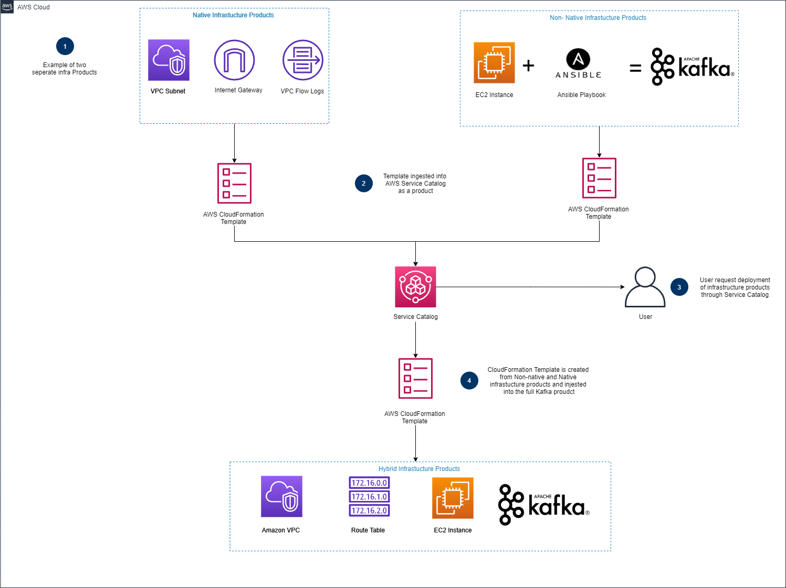

# **Infrastructure Foundation**
In this program, a template and data file are uploaded, passed through linting, validated, created, and distributed as a product on to the AWS Service Catalog. From there, the customer can select the instance and have it start up upon request. The end goal of this project is to make the integration of new products into service catalog as simple and streamlined as possible, while also reducing the time spent on testing for compliance and security issues.
## **What is this product?**

This program takes in an AWS CloudFormation template and passes it through a series of tests. It validates the code to make sure it executes the deployment of an instance properly, as well as to ensure that it is written in a security-focused way. These tests include being passed through a lint service(cfn-lint) as well as through a secret detection program(detect-secrets). Once it passes through these tests, it then goes through one of two paths; the creation of a new product, and the update of an existing product.
## **Naming convention**
In order for the pipeline to execute, the template must be named according to the following rules. The name of the folder should be the name of the product, and the name of the template should be 'nameofproduct'_template.yml, where 'nameofproduct' is the name of the product you are trying to add. The program requires a folder under the validation_build/service_catalog directory that is named after the product that includes a datafile.json with RequestType and Version variables. For new products, the RequestType should be set to New. For existing products, when looking to update, the version in the datafile must be updated. The resulting file structure should look like:  
**validation_build/service_catalog/${*WhichInstance*}/${*WhichInstance*}_template.yml.**

## **Installation** ##
1. Ensure that your CLI(command line interface) is running in either bash or another linux based operating command structure. For Mac users, this is how the CLI works off the bat. For Windows users, there are many guides online that can walk you through the setup step by step, such as [here](https://www.howtogeek.com/249966/how-to-install-and-use-the-linux-bash-shell-on-windows-10/).

## **Instructions for adding/updating a product**

### For a new product:
1. Create a folder containing the template for the new product, with the folder name and template file name matching the rules in the naming convention. 
2. Follow the common instructions below.

### For updating a product
1. Follow the common instructions below.

### Common Instructions

1. Use `git add...` and `git commit...` commands to commit the local changes.  Example commands:
   ```
   git add --all
   git commit -m "test commit"

2. Run deploy.sh

    ```
    Usage: ./deploy.sh [options [parameters]]

    Options:
    -e|--env [env_name], Environment name (default: dev)
    -r|--region [region_name], Region name (default: us-east-1)
    -a|--artifact [artifact_bucket], Artifact bucket name (default: pipelineartifactsource)
    -s|--source [source_bucket], Source bucket name (default: infrafoundationstest)
    -h|--help, Print help
