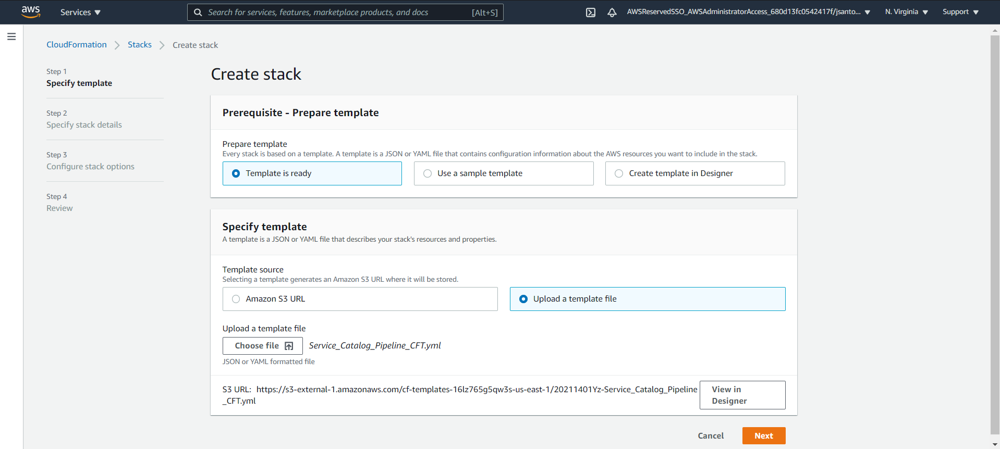

# **Infrastructure Foundation**
In this program, a template and data file are uploaded, passed through linting, validated, created, and distributed as a product on to the AWS Service Catalog. From there, the customer can select the instance and have it start up upon request. The end goal of this project is to make the integration of new products into service catalog as simple and streamlined as possible, while also reducing the time spent on testing for compliance and security issues.
## **What is this product?**

This program takes in an AWS CloudFormation template and passes it through a series of tests. It validates the code to make sure it executes the deployment of an instance properly, as well as to ensure that it is written in a security-focused way. These tests include being passed through a lint service(cfn-lint) as well as through a secret detection program(detect-secrets). Once it passes through these tests, it then goes through one of two paths; the creation of a new product, and the update of an existing product.
## **Naming convention**
In order for the pipeline to execute, the template must be named according to the following rules. The name of the folder should be the name of the product, and the name of the template should be 'nameofproduct'_template.yml, where 'nameofproduct' is the name of the product you are trying to add. The program requires a folder under the Parsing/ServiceCatalog directory that is named after the product that includes a datafile.json with RequestType and Version variables. For new products, the RequestType should be set to New. For existing products, when looking to update, the version in the datafile must be updated. The resulting file structure should look like:  
**Parsing/ServiceCatalog/${*WhichInstance*}/${*WhichInstance*}_template.yml.**

## **Installation** ##
1. Ensure that your CLI(command line interface) is running in either bash or another linux based operating command structure. For Mac users, this is how the CLI works off the bat. For Windows users, there are many guides online that can walk you through the setup step by step, such as [here](https://www.howtogeek.com/249966/how-to-install-and-use-the-linux-bash-shell-on-windows-10/).
2. Once you have ensured that the CLI is set up properly, make an empty directory in the location you would like the repository to reside in. To do this, simply go into the CLI and type the following:
```
mkdir nameOfDirectory
```
This will create a new directory called nameOfDirectory in the location you have chosen. Feel free to change nameOfDirectory to a better name that suits your needs.
3. Clone this directory into the location we just created earlier. A fast way to do this via the CLI is to type in the following:
```
git clone https://github.com/VerticalRelevance/InfrastructureFoundations-RefArchitecture.git
```
4. After cloning the repository on to your local machine, go to your AWS page and navigate to CloudFormation. Select create new stack, and go to src/pipeline/ and select the “Service_Catalog_Pipeline_CFT.yml” cloudformation template file. Repeat this process again, but this time launch the “Pipeline_CodeBuilds.yml” cloudformation template.



5. Set up a CodeCommit repository with the same file structure as found on GitHub. A simple way to do this is to make another clone of the directory, but this time add the name CodeCommit to the end of the mkdir statement:
```
mkdir nameOfDirectoryCodeCommit
```
6. Once the repository is cloned, do a git push --all to the URL of the CodeCommit repository we just set up. The command will look something like this:
```
git push https://git-codecommit.us-east-1.amazonaws.com/v1/repos/ExampleRepository --all
```
Replace the HTTPS URL with your own CodeCommits HTTPS URL.
6. Inside of the CodeCommit repository, navigate to validation_build/service_catalog_products/ and add any products that need to be created/updated with the correct RequestType and version. Making these changes will trigger the pipeline to start with either creating or updating a product.
 


7. After the pipeline has created/updated the product(s), navigate to Service Catalog on the AWS console, find the desired product on the Products tab, select the product, and click “Launch Product” with the custom parameters.


## **Instructions for adding/updating a product**

### For a new product:
1. Create a folder containing the template and datafile.json for the new product, with the folder name and template file name matching the rules in the naming convention. Below is what the datafile.json document should look like/contain. The only time RequestType is set to new is when you are creating a new product. If you are trying to update a product, the datafile.json will have changed the value from New to Old and you will not need to change that value. See the instructions for updating a product for more information.
```json
{"RequestType": "New", "Version": 0.1}
```
2. Upload said folder to the Parsing/ServiceCatalog directory. Make sure that the spelling is the same throughout the project. 
3. Once the pipeline has completed validating the template, it will begin its deployment to Service Catalog. From this point on, follow the common instructions below.

### For updating a product
1. In the datafile.json document, make sure the version has been incrimented to a new version. The pipeline checks to see if the version in the datafile matches the existng version in Service Catalog. If the versions do not match, it will begin to validate the new template and update the product in Service Catalog. Below is what the datafile.json document should look like for an existing product. Note how RequestType is set to Old, and the Version has been changed.
```json
{"RequestType": "Old", "Version": 0.2}
```

2. Upload the updated template and datafile.json to the folder inside of the Parsing/ServiceCatalog directory. Make sure that the Version has been changed, otherwise the pipeline will not deploy the updated template.
3. Follow the common instructions below.

### Common Instructions

4. Compress the following files and folders into a zipped folder called Source(yes it must be capitalized) and upload the file(NOT FOLDER, in S3 a zipped folder is considered a file) to the S3 bucket in this format:
- Source.zip
    - catalog_build
    - Parsing
        - ServiceCatalog
            - ProductName
                - ProductName_template.yml
                - datafile.json

5. Once completed, push the changes in the repository on your local machine to the CodeCommit repository on AWS. This will trigger the pipeline, either creating the new product or updating an existing one. 